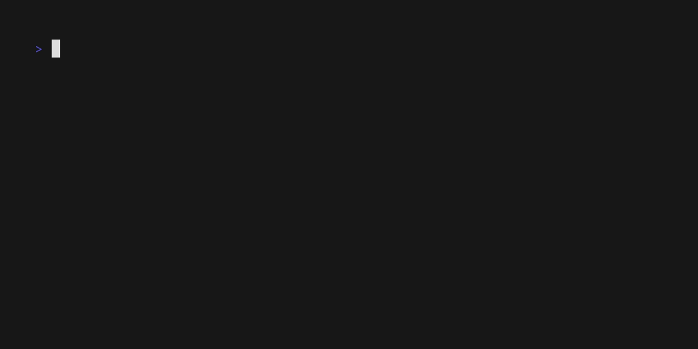

# dots
**dots** is a bullet-journal based productivity TUI app. it is partly based on my previous project [habitmap](https://github.com/tb-dhk/habitmap), a habit tracker CLI.

dots incorporates the four main types of bullet journal spreads:
- tasks (inspired by rapid logging)
- lists (inspired by collections)
- habits (based on [habitmap](https://github.com/tb-dhk/habitmap))
- journals (such as daily reflections, mood logs, etc.)

only tasks are implemented at the moment, but i plan to add the other components in the near future.

## installation

### manual build

prerequisites:
- linux, macos or wsl
- git
- python 3.10 or later
- make
- pip
- gum (for pretty installer)

run the following code:
```
# clone the repository
git clone https://github.com/tb-dhk/dots
cd dots

# build and install
make install
```


do note that the install script uses **gum** if it is installed. to opt out, run:
```
make install USE_GUM=false
```

### download
simply download one of the build artifacts from one of our releases!

the following commands will install dots to /usr/local/bin.
```
# linux
curl -LO https://github.com/tb-dhk/dots/releases/download/0.2.0/dots-linux -o /usr/local/bin/dots

# macos
curl -LO https://github.com/tb-dhk/dots/releases/download/0.2.0/dots-macos -o /usr/local/bin/dots

# windows
curl -LO https://github.com/tb-dhk/dots/releases/download/0.2.0/dots-windows.exe -o /usr/local/bin/dots
```

## usage
to run the app, simply run the following command:

```
dots
```
options:
- `-n` or `--no-home-screen`: start dots without the home screen

## app structure
- tasks
  - list: a list view of all tasks
  - day: table view of all tasks, by day
  - week: table view of all tasks, by week
  - month: table view of all tasks, by month
  - year: table view of all tasks, by year
- habits
    - duration: graph of duration habits. can be based on habit or day.
        - duration habits refer to habits that are fulfilled in laps over long periods of time, e.g. sleep
        - these habits can have goals as well, e.g. **8 hours** of sleep per day.
    - progress: graph of progress habits. can be based on habit or day.
        - progress habits are habits with a set goal, e.g. drinking **8 cups** of water a day.
        - frequency habits are tracked similarly to progress habits, but do not necessarily have a goal, e.g. memorising flashcards.
            - they are also included in this view, but only in habit-based mode.
    - heatmap: generates a heatmap based on the habits
        - activity can be based on day, week, month or year.
        - there is also a yearly calendar heatmap (similar to GitHub's contribution heatmap)
        - this part of the app was inspired by my earlier project [habitmap](https://github.com/tb-dhk/habitmap).
    - manage: manage your habits' names, units and targets.
    - new: add new habits.
- lists
  - *(coming in 0.3)*
- logs
  - *(coming in 0.3)*

## keybindings

### general navigation
**arrow keys**  
- **up/down**:  
  - navigate rows.  
  - move between the navbar, main screen, and options.  
  - move the cursor to the start/end in the text input field.  
- **left/right**:  
  - switch between navbar options.  
  - navigate columns.  
  - cycle through options.  
  - move the cursor left/right in the text input field.  

### task view keybindings

#### global (available in all task views)  
- `:`: add a new task (focus input field).  
- `x`: toggle completion.  
- `.`: schedule for today/unschedule if due today.  
- `1`, `2`, `3`: set priority (low, normal, high).  
- `r`: remove task (confirm with second press).  
- `esc`: cancel removal or exit input field.  

#### list task view  
- `e`: edit task name (requires text input).  
- `<`, `>`: change/set due date (symbolic difference between migrate/schedule).  
- `t`: edit tags.  
- `m`: move task to another parent or orphan.  
- `enter`: save changes and exit input field.  

#### non-list task view  
- `v`: switch to list view.  
- `e`: edit task attribute under cursor (navigate to input field).  
- `d`: navigate to another date if cursor is on the date field.  

### habit views

#### habit management views (manage habits and new habit views) 
- `e`: edit habit details.  
- `r`: remove habit (confirm with second press).  
- `enter`: submit entry (for new habit view).  

#### habit tracking views (duration, progress and heatmap views)
- `e`: add a record.  
- `:`: add a date (in progress habits view, in habit-based mode).  

## configuration
configuration is not yet available, but there is a `config.toml` file in the `~/.dots` directory that you can edit manually. the file is created when you run the app for the first time. do note that the file should not be changed.
